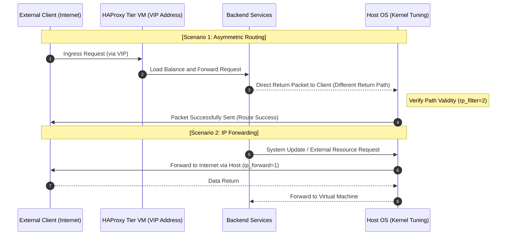
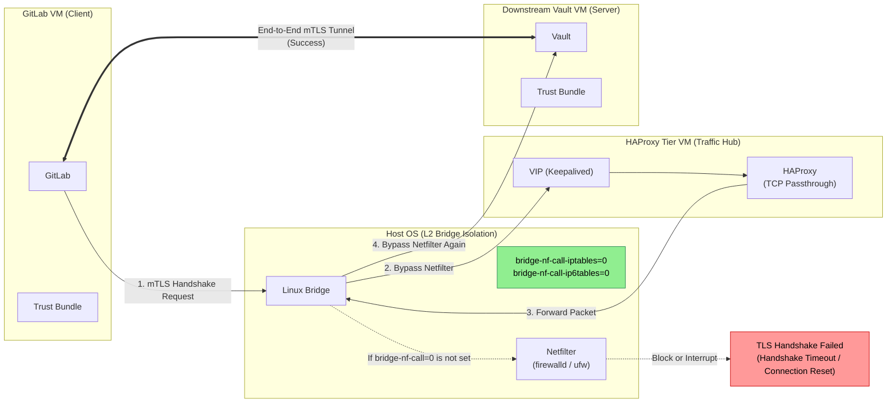

# Hypervisor Kernel Tuning

Role `hypervisor_baseline` applies the kernel and firewall settings of the physical KVM host through `playbook_hypervisor.yaml`. Every guest network of `platform-foundation` and of the consumer repositories depends on these settings.

## Section 1. Rationale

### Item A. Asymmetric Routing and Reverse Path Filtering

1. Non-Kubernetes services are exposed through an HAProxy and Keepalived tier, and inter-node communication primarily follows an asymmetric routing pattern.
2. A return packet MAY arrive on a network interface other than the interface of the request, and strict reverse path filtering drops that packet as IP spoofing.
3. Loose reverse path filtering accepts the asymmetric return path, and IP forwarding lets the host route guest traffic to external networks.

### Item B. Bridge Netfilter and mTLS

1. The libvirt bridge sends L2 traffic to the iptables of the host by default.
2. In high-traffic scenarios or complex mTLS handshakes, the default causes double filtering and connection tracking conflicts, and the handshake fails with a timeout or a connection reset.
3. Disabling `bridge-nf-call-*` lets pure L2 packets bypass the netfilter of the host, and routing decisions return to L3 processing.
4. Inter-segment L3 routing traffic remains under the connection tracking of the host.
5. The connection tracking table capacity MUST increase and TCP state validation MUST relax to keep connections alive during high traffic and HA failovers.

### Item C. MTU and MSS

1. The infrastructure MTU is 1450, which reserves overhead for VXLAN encapsulation.
2. The host MUST clamp the TCP MSS in the `mangle` table, because oversized TCP segments cause fragmentation or black hole failures.

## Section 2. Applied Settings

### Item A. Kernel Parameters

`tasks/kernel-sysctl.yaml` persists the following parameters:

| Parameter                                          | Value     | Purpose                                    |
| -------------------------------------------------- | --------- | ------------------------------------------ |
| `net.ipv4.conf.all.rp_filter`                      | `2`       | Loose reverse path filtering               |
| `net.ipv4.conf.default.rp_filter`                  | `2`       | Loose reverse path filtering for new links |
| `net.ipv4.ip_forward`                              | `1`       | L3 routing of guest traffic                |
| `net.bridge.bridge-nf-call-iptables`               | `0`       | L2 bridge traffic bypasses iptables        |
| `net.bridge.bridge-nf-call-ip6tables`              | `0`       | L2 bridge traffic bypasses ip6tables       |
| `net.bridge.bridge-nf-call-arptables`              | `0`       | L2 bridge traffic bypasses arptables       |
| `net.netfilter.nf_conntrack_max`                   | `2097152` | Connection tracking table capacity         |
| `net.netfilter.nf_conntrack_tcp_be_liberal`        | `1`       | Relaxed TCP state validation               |
| `net.netfilter.nf_conntrack_tcp_timeout_time_wait` | `30`      | Faster recycling of `TIME_WAIT` entries    |

### Item B. MSS Clamping

1. `tasks/mss-clamp.yaml` adds two permanent firewalld direct rules on `ipv4 mangle FORWARD`, one matching the source and one matching the destination `hypervisor_baseline_mss_clamp_cidr` (`172.16.0.0/16`).
2. Each rule sets the MSS of TCP `SYN` segments to `hypervisor_baseline_mss_clamp_value` (`1360`).
3. The task queries the permanent configuration before adding a rule, which keeps a repeated run free of changes.
