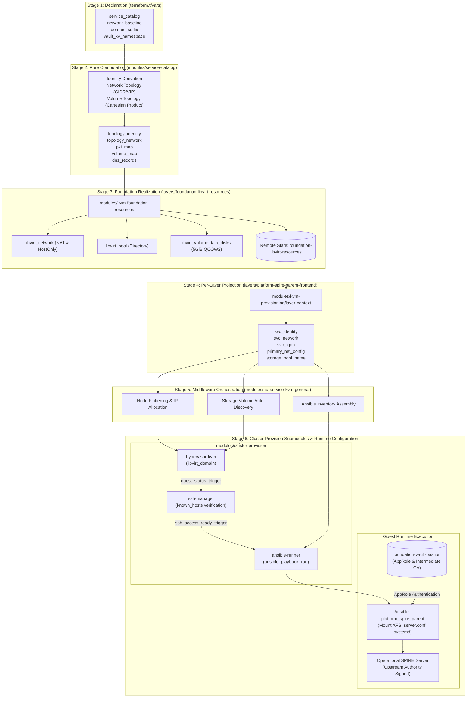
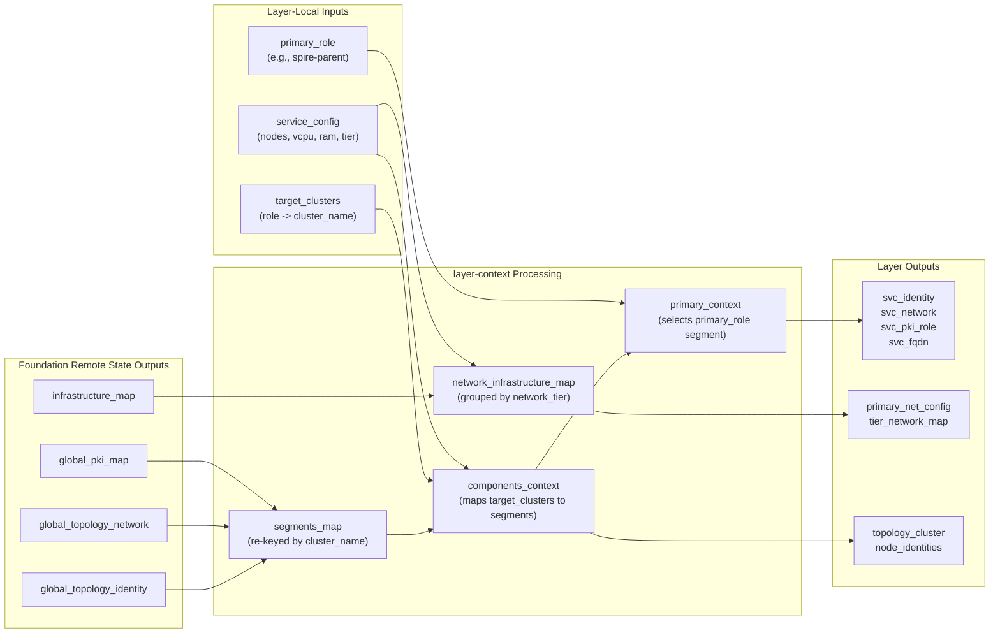
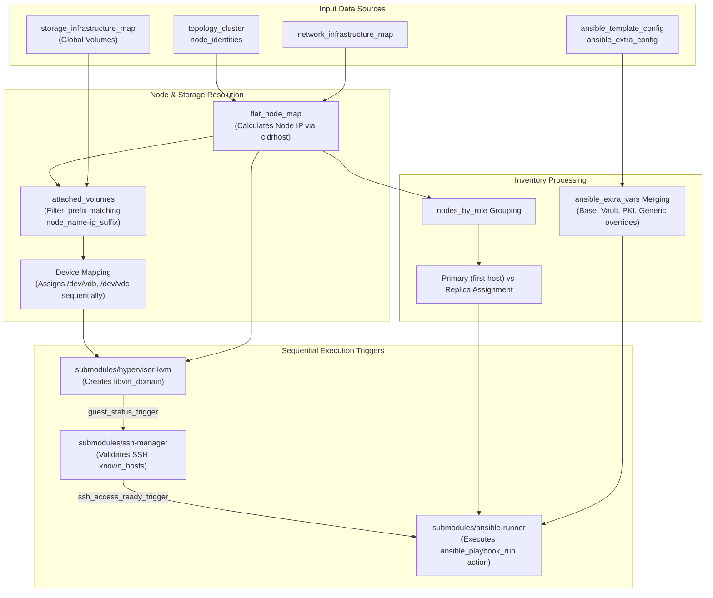

# Service Catalog and KVM Provisioning Pipeline

This specification establishes the realization requirements from the `service_catalog` declaration to an operational guest virtual machine under the Libvirt provider. The execution flow traverses the module sequence comprising `service-catalog`, `kvm-foundation-resources`, `layer-context`, `ha-service-kvm-general`, and the three `cluster-provision` submodules, followed by Packer image assembly and Ansible role execution. The `platform-spire-parent-frontend` layer serves as the primary implementation reference across this specification. Identical structural requirements govern the companion consumers of `ha-service-kvm-general`, including `platform-harbor-origin-frontend`, `platform-keycloak-frontend`, and `platform-vault-frontend`. Architectural rationale for SPIRE-specific security decisions resides in `documentation/architecture-decision-record/20260830_1530-spire-parent-bootstrap-security-posture.md` and `planning/architecture_meta-platform.md` Section 9.

## Section 1. Pipeline Topology and Governance Boundary

### Item A. Six-Stage Realization Path

1. Stage 1 (Declaration): The calling layer `terraform.tfvars` MUST declare one `service_catalog` entry per service. The `foundation-libvirt-resources` layer SHALL hold the aggregated catalog for the entire repository.
2. Stage 2 (Pure Computation): The `service-catalog` module MUST derive identity, network, and storage topology from the catalog through Terraform `locals` blocks only. The `service-catalog` module SHALL NOT declare any managed resources.
3. Stage 3 (Foundation Realization): The `kvm-foundation-resources` module MUST invoke the `service-catalog` module and SHALL materialize the derived topology into `libvirt_network`, `libvirt_pool`, and `libvirt_volume` resources for every service defined in the catalog.
4. Stage 4 (Per-Layer Projection): The `layer-context` module of each consuming layer MUST read the foundation outputs through a `terraform_remote_state` data source. The `layer-context` module SHALL resolve local `target_clusters`, `primary_role`, and `service_config` inputs into a layer-scoped context object.
5. Stage 5 (Middleware Orchestration): The `ha-service-kvm-general` module MUST flatten per-node compute specifications into a node mapping. The `ha-service-kvm-general` module SHALL assemble the Ansible inventory and invoke the three `cluster-provision` submodules.
6. Stage 6 (Guest Realization and Configuration): The `hypervisor-kvm` submodule MUST create the `libvirt_domain` resource from a pre-built Packer base image. The `ssh-manager` submodule MUST verify guest SSH connectivity. The `ansible-runner` submodule MUST execute role-based configuration against the target guest.

### Item B. End-to-End Pipeline Overview

### Item C. Global Variable Flow and Data Contract

| Pipeline Stage | Processing Component                  | Input Variables                                                                                          | Derived Computations                                                                                            | Output Variables / Artifacts                                                                           | Consuming Downstream                                         |
| -------------- | ------------------------------------- | -------------------------------------------------------------------------------------------------------- | --------------------------------------------------------------------------------------------------------------- | ------------------------------------------------------------------------------------------------------ | ------------------------------------------------------------ |
| Stage 1 to 2   | `modules/service-catalog`             | `service_catalog`, `network_baseline`, `domain_suffix`, `vault_kv_namespace`                             | `_flat_catalog`, `identity_map`, `network_topology`, `_volume_topology_raw`                                     | `topology_identity`, `topology_network`, `pki_map`, `volume_map`, `dns_records`, `credential_paths`    | `kvm-foundation-resources`                                   |
| Stage 3        | `layers/foundation-libvirt-resources` | `service-catalog` outputs                                                                                | `segments`, `global_volume_map`, `global_dns_hosts`                                                             | `infrastructure_map`, `storage_infrastructure_map`, `global_topology_*`                                | Consuming service layers via `terraform_remote_state`        |
| Stage 4        | `modules/layer-context`               | Foundation remote state outputs, `target_clusters`, `primary_role`, `service_config`                     | `segments_map`, `components_context`, `primary_context`, `network_infrastructure_map`                           | `svc_identity`, `svc_network`, `svc_fqdn`, `primary_net_config`, `topology_cluster`, `node_identities` | Layer `main.tf`, `locals.tf`, `ha-service-kvm-general`       |
| Stage 5        | `modules/ha-service-kvm-general`      | `layer-context` outputs, `storage_infrastructure_map`, `ansible_template_config`, `ansible_extra_config` | `flat_node_map`, `attached_volumes` (auto-discovery), `ansible_inventory_data`, `hypervisor_kvm_infrastructure` | Provision triggers, rendered `inventory.yaml`, rendered `ansible.cfg`                                  | Submodules `hypervisor-kvm`, `ssh-manager`, `ansible-runner` |
| Stage 6        | `cluster-provision` & Ansible         | Provision configurations, base QCOW2 image, Bastion Vault credentials                                    | Copy-on-write OS disk, deterministic MAC derivation, Cloud-init network template                                | Running KVM guest domain, active `spire-server` daemon                                                 | Operational SPIRE Server, downstream SPIRE agents            |

### Item D. Module Versus Layer Boundary

1. Every component defined from Stage 2 through Stage 6 in Item A MUST function as a repeatable Terraform module. A module SHALL NOT own an independent Terraform state backend.
2. The `platform-spire-parent-frontend` component MUST function as an independent layer. The layer SHALL maintain a dedicated backend state address declared in `providers.tf`.
3. The `foundation-libvirt-resources` component MUST function as an independent foundation layer. The layer state SHALL hold every shared `libvirt_network`, `libvirt_pool`, and `libvirt_volume` resource. Consuming service layers MUST NOT declare competing resources for these foundation objects.

### Item E. Ownership Boundary of `service_catalog`

1. The consuming project declaring a `service_catalog` entry MUST maintain ownership of that configuration schema. The `meta-platform` repository SHALL NOT aggregate distinct project catalogs into a single state file when composite `pki_map` keys risk name collisions across identical service and component pairs.
2. The `meta-platform` repository MUST define four global parameters consumed across all catalog entries: `network_baseline`, `pki_config`, `domain_suffix`, and `vault_kv_namespace`.
3. Secret material MUST NOT traverse `terraform_remote_state` outputs. The `layer-context` module SHALL accept `guest_vm_data` and `security_pki_outputs` sourced from a `vault_generic_secret` data source or an authenticated Vault API response.

### Item F. Libvirt Provider Connection

1. The `dmacvicar/libvirt` Terraform provider implements a dedicated RPC client rather than linking against the system `libvirt.so` library, and that client resolves a bare `qemu:///system` URI to a fixed legacy socket path.
2. The host libvirt daemon splits into modular units (`virtqemud`, `virtnetworkd`, `virtstoraged`), and that split removes the legacy compatibility socket on which the bare URI resolution depends.
3. Every layer declaring the `libvirt` provider (`foundation-libvirt-resources`, `platform-cilium-frontend`, `platform-harbor-origin-frontend`, `platform-keycloak-frontend`, `platform-spire-parent-frontend`, and `platform-vault-frontend`) MUST set `uri` to `qemu:///system?socket=/var/run/libvirt/virtqemud-sock`, naming the modular daemon's own socket explicitly through the provider's documented `socket` query parameter.
4. A real `virsh` client resolves the bare `qemu:///system` URI correctly through `libvirt.so`, and that resolution difference confines the explicit socket requirement to the Terraform provider alone.

### Item G. Libvirt Socket Permission Delegation

1. Role `hypervisor_baseline` delegates the legacy `libvirtd.socket` and the three modular daemon sockets (`virtqemud.socket`, `virtnetworkd.socket`, `virtstoraged.socket`) to the `libvirt` group through a matching `SocketGroup=libvirt` and `SocketMode=0770` systemd drop-in for each unit.
2. Role `hypervisor_baseline` adds the operator user account to the `libvirt` group, granting non-root read and write access to every delegated socket.
3. Role `hypervisor_baseline` stops and disables the legacy `libvirtd.service` and the three legacy `libvirtd` socket units, since the host runs the modular daemon split rather than the monolithic daemon.
4. A non-root operator invokes `virsh -c qemu:///system` or the Terraform provider's `qemu:///system?socket=...` URI from Item F against the delegated modular sockets without `sudo`, satisfying the non-root access requirement without switching to `qemu:///session`.

### Item H. System Mode Retained over Session Mode

1. `qemu:///session` establishes a fully isolated per-user libvirt instance with an independent storage pool and an independent default network, sharing no state with `qemu:///system`.
2. Session mode's default networking relies on unprivileged usermode networking, and the platform's `service_catalog` and `hypervisor_baseline` firewalld integration depend on a custom bridged, routed, and NAT network topology unavailable without a separate privilege-escalation path, such as a setuid `qemu-bridge-helper` binary.
3. Adopting session mode would require redesigning the network layer rather than migrating existing state, since every `libvirt_network`, `libvirt_pool`, and `libvirt_domain` resource under `qemu:///system` is invisible to a session-mode connection.
4. The socket permission delegation in Item G satisfies the non-root access requirement without that redesign, and system mode remains the platform's libvirt connection model.

## Section 2. Service Catalog Specification

Location: `terraform/modules/service-catalog`. The module accepts `service_catalog`, `network_baseline`, `domain_suffix`, and `vault_kv_namespace` variables, and exposes six structured outputs. The module contains zero `resource` declarations.

### Item A. Input Contract & Schema Specification

| Variable Name        | Type Constraint | Default Value    | Description                                           | RFC 2119 Validation Constraint                                                     |
| -------------------- | --------------- | ---------------- | ----------------------------------------------------- | ---------------------------------------------------------------------------------- |
| `service_catalog`    | `map(object)`   | None (Mandatory) | SSoT catalog declaring services and nested components | Keys MUST match `^[a-z0-9-]+$`. Runtime and Provider MUST belong to allowed enums. |
| `network_baseline`   | `object`        | Defined baseline | Global networking baseline parameters                 | CIDR block MUST be valid. `global_mac_prefix` MUST match `XX:XX:XX`.               |
| `domain_suffix`      | `string`        | None (Mandatory) | Base DNS domain suffix for FQDN derivation            | MUST NOT contain leading or trailing dot characters.                               |
| `vault_kv_namespace` | `string`        | None (Mandatory) | Vault KV storage mount root path                      | MUST NOT contain leading or trailing slash characters.                             |

1. The `service_catalog` variable MUST conform to `map(object)`. The map key SHALL represent the service name. Each service object SHALL define `owner`, `project_code`, `stage`, and a nested `components` map.
2. Each component object within `components` MUST declare `provider`, `runtime`, `cidr_index`, and `ip_range` containing `start_ip` and `end_ip`. Each component object MAY declare optional `tags`, `node_groups`, `ports`, `data_disks`, `ingress`, and `oidc_client` attributes.
3. The `network_baseline` variable MUST declare `cidr_block`, `host_vip_offset`, `global_mac_prefix`, `global_mtu`, `global_mss`, `node_exporter_port`, and address-space parameters comprising `cidr_subnet_bits`, `cidr_nat_offset`, and `cidr_index_max`.

### Item B. Validation Contract

1. The `service_catalog` variable MUST enforce twelve validation rules prior to graph evaluation. The rules SHALL validate `runtime` enum membership, `provider` enum membership, `stage` enum membership, `cidr_index` range boundaries, global `cidr_index` uniqueness, `end_ip` greater than or equal to `start_ip`, IP host boundary validity between 1 and 254, DNS-safe service naming, DNS-safe component naming, composite key uniqueness, DNS-safe `project_code` naming, and non-empty ingress subdomain declarations.
2. The `network_baseline` variable MUST enforce four validation rules. The rules SHALL validate CIDR format correctness, MAC prefix format matching `XX:XX:XX`, `host_vip_offset` boundaries below 255, and non-overlapping NAT offset calculations.
3. The `vault_kv_namespace` variable MUST enforce a validation rule prohibiting leading and trailing slash characters.
4. All variable validation blocks MUST complete evaluation before Terraform computes `locals` blocks. A validation failure SHALL terminate plan execution immediately.

### Item C. Identity and Naming Derivation

1. The `_flat_catalog` local MUST merge each service and component pair into a single map keyed by `${service_name}-${comp_name}`. The local SHALL construct `cluster_name` as `${project_code}-${service_name}-${comp_name}`, `storage_pool_name` as `${cluster_name}-pool`, and `hash_prefix` as the first eight hexadecimal characters of `md5(cluster_name)`.
2. The `identity_map` local MUST derive `bridge_name_host` as `vbr${hash_prefix}` and `bridge_name_nat` as `vbr${hash_prefix}-n`. The derived bridge names SHALL depend exclusively on `cluster_name`.
3. The `component_roles` local MUST derive `dns_san` by concatenating ingress subdomains, the shorthand `${service_name}.${stage}.${domain_suffix}` for frontend components, and `${cluster_name}.${stage}.${domain_suffix}`, followed by the `distinct()` operation.
4. The `component_roles` local MUST assign `auth_config.method` to `kubernetes` for `kubeadm` and `microk8s` runtimes. The local SHALL assign `auth_config.method` to `approle` for baremetal runtimes.
5. The `pki_map` output MUST expose the computed role metadata keyed by the composite service-component identifier.

### Item D. Network Topology Derivation

1. The `network_topology` local MUST calculate each component primary CIDR block via `cidrsubnet(network_baseline.cidr_block, cidr_subnet_bits, cidr_index)`. The local SHALL calculate the paired NAT CIDR block at offset `cidr_index - cidr_nat_offset`.
2. The `network_topology` local MUST calculate `vip` as `cidrhost(cidr_block, host_vip_offset)`. The local SHALL compute `node_ips` as the sequential IP range spanning `start_ip` through `end_ip`.
3. The `network_topology` local MUST derive a deterministic segment MAC address from `md5("${cidr_index}${key}")` prefixed with `global_mac_prefix`.
4. The `dns_records` local MUST pair every SAN in `pki_map` with the corresponding segment VIP address.

### Item E. Volume Topology Derivation

1. The `_volume_topology_raw` local MUST compute the Cartesian product of component declarations, node IP ranges, and declared `data_disks` entries. The local SHALL format `volume_name` as `${cluster_name}-node-${node_ip_suffix}-${disk.name_suffix}.qcow2`.
2. The `volume_topology` output MUST index raw volume records by `volume_name`.

### Item F. Output Contract & Transformation Mapping

| Output Variable     | Source Derivation        | Structural Shape                                  | Consuming Module                            |
| ------------------- | ------------------------ | ------------------------------------------------- | ------------------------------------------- |
| `topology_network`  | `local.network_topology` | Nested `map(service -> map(component -> object))` | `kvm-foundation-resources`, `layer-context` |
| `topology_identity` | `local.identity_map`     | Nested `map(service -> map(component -> object))` | `kvm-foundation-resources`, `layer-context` |
| `pki_map`           | `local.pki_map`          | Flat `map(cluster_key -> object)`                 | `kvm-foundation-resources`, `layer-context` |
| `volume_map`        | `local.volume_topology`  | Flat `map(volume_name -> object)`                 | `kvm-foundation-resources`                  |
| `dns_records`       | `local.dns_records`      | Flat `map(fqdn -> vip)`                           | `kvm-foundation-resources`                  |
| `credential_paths`  | `local.credential_paths` | Nested `map(service -> map(component -> string))` | Consuming service layers                    |

1. Outputs `topology_network` and `topology_identity` MUST maintain nesting structured by service name and component name.
2. Outputs `volume_map`, `pki_map`, and `dns_records` MUST expose flat maps keyed by the composite cluster key or volume identifier.
3. The `credential_paths` output MUST expose Vault KV path strings structured as `${vault_kv_namespace}/${service}/${component}`. The output SHALL NOT contain plaintext secret data.

## Section 3. Foundation Realization: `kvm-foundation-resources`

Location: `terraform/modules/kvm-foundation-resources`, invoked from the `foundation-libvirt-resources` layer.

### Item A. Global Network and Storage Materialization

1. The module MUST invoke `service-catalog` and re-key outputs by `identity.cluster_name` into the `segments` map.
2. The `libvirt_network.nat_networks` and `libvirt_network.hostonly_networks` resources MUST iterate `net_infrastructure` to create one NAT bridge and one HostOnly bridge per segment. Both network resources SHALL attach `global_dns_hosts` to the `dns.host` configuration block.
3. The `libvirt_pool.storage_pools` resource MUST create one directory-backed storage pool for each distinct `storage_pool_name` derived from the union of `identity_map` and `volume_map`.
4. The `libvirt_volume.data_disks` resource MUST iterate `global_volume_map` and create persistent `qcow2` volumes. The SPIRE Parent 5 GiB data volume SHALL materialize in this foundation layer.
5. A `check` block MUST assert that every `storage_pool_name` conforms to the regular expression `^[a-zA-Z0-9_-]+$` before storage pool creation.

### Item B. Foundation Output Contract

1. The `infrastructure_map` output MUST merge each segment network definition with its load balancer configuration and backend server list. Consuming service layers SHALL ingest this output.
2. Outputs `global_topology_identity`, `global_topology_network`, `global_pki_map`, `global_network_baseline`, `global_domain_suffix`, and `global_pki_config` MUST pass corresponding catalog outputs and baseline parameters directly to downstream consumers.
3. The `storage_infrastructure_map` output MUST expose the global volume map for downstream disk auto-discovery.

## Section 4. Layer Context: Per-Layer SSoT Projection

Location: `terraform/modules/kvm-provisioning/layer-context`.

### Item A. Context Projection Flow

### Item B. Input Contract

1. Input variables `global_topology_identity`, `global_topology_network`, `global_pki_map`, `global_network_baseline`, and `infrastructure_map` MUST match the schema of the corresponding `kvm-foundation-resources` outputs.
2. The `target_clusters` variable MUST map layer-local role names to `cluster_name` strings. The `primary_role` variable MUST identify the primary role key within `target_clusters`.
3. The `service_config` variable MUST define per-role compute parameters including `role`, `network_tier`, `base_image_path`, and `nodes`. Every role key in `service_config` MUST exist in `target_clusters`.
4. Variables `prod_vault_svc_vip` and `security_pki_outputs` MUST default to `null` to accommodate bootstrap layers that execute before Production Vault availability.

### Item C. Primary Role Resolution

1. The `segments_map` local MUST index identity and network structures by `cluster_name`.
2. The `components_context` local MUST map every role in `target_clusters` to its resolved segment definition. Outputs `svc_identity`, `svc_network`, `svc_pki_role`, and `svc_fqdn` SHALL derive from the role specified by `primary_role`.
3. Multi-role layers MUST extract non-primary role definitions directly from `components_context`.

### Item D. Network Tier Grouping

1. The `network_infrastructure_map_grouped` local MUST group infrastructure records by `network_tier`. The `network_infrastructure_map` local SHALL select the initial element of each tier group.
2. The `primary_net_config` output MUST select the infrastructure configuration matching the `network_tier` of `primary_role`.

### Item E. Vault Agent Identity Base

1. The `all_vault_agent_identity_bases` local MUST evaluate to an empty map when `security_pki_outputs` equals `null`.
2. When `security_pki_outputs` contains data, `all_vault_agent_identity_bases` MUST assemble Vault Agent identity structures excluding `secret_id`. The calling layer root module SHALL inject `secret_id` independently.

### Item F. Asymmetric Static Routes

1. The `asymmetric_static_routes` local MUST compute inter-tier static routes using the target tier load-balancer VIP as the next hop gateway.
2. An output `precondition` MUST verify that multiple roles within the same `network_tier` produce identical route lists.
3. A consuming layer MAY omit static routes when cross-tier connectivity is not required.

### Item G. Output Contract

1. The output interface MUST expose `svc_identity`, `svc_network`, `svc_pki_role`, `svc_fqdn`, `network_infrastructure_map`, `primary_net_config`, `tier_network_map`, `sec_vm_credentials`, `prod_vault_endpoint`, `storage_pool_name`, `topology_cluster`, `node_identities`, `vault_agent_identity_base`, `global_mss`, `global_mtu`, `node_exporter_port`, `primary_context`, `components_context`, `asymmetric_static_routes`, `prod_vault_svc_vip`, `all_vault_agent_identity_bases`, and `global_topology_network`.

## Section 5. HA Service KVM General: Middleware Orchestration

Location: `terraform/modules/kvm-provisioning/ha-service-kvm-general`.

### Item A. Middleware Orchestration Flow

### Item B. Node Flattening and Volume Auto-Discovery

1. The `flat_node_map` local MUST expand role definitions against declared node maps, generating unique node entries keyed by `${node_name_prefix}-${node_suffix}`. The local SHALL compute node IP addresses via `cidrhost()`.
2. The `attached_volumes` attribute of each node MUST merge explicitly declared volumes with records in `storage_infrastructure_map` matching the prefix `${node_name_prefix}-${ip_suffix}-`. The local SHALL assign sequential `/dev/vd${b..z}` device names to discovered volumes.
3. The `nodes_by_role` local MUST group flattened node definitions by role name for inventory assembly.

### Item C. Ansible Inventory Assembly

1. The `ansible_inventory_data` local MUST assign the lexicographically first node of each role to the `primary` inventory group. The local SHALL assign remaining nodes to the `replica` group.
2. The module MUST pass four standard playbook paths to `ansible-runner`: `playbook_platform.yaml`, `playbook_infra_statesfulsets.yaml`, `playbook_infra_frontend.yaml`, and `playbook_provision.yaml`.
3. The `ansible_extra_vars` local MUST merge extra variable sources applying precedence where the calling layer `ansible_generic_config.extra_vars` overrides default values.

### Item D. Interface Translation and Submodule Triggering

1. The `hypervisor_kvm_infrastructure` local MUST translate foundation network structures into the input schema required by the `hypervisor-kvm` submodule.
2. The module MUST invoke `hypervisor_kvm` with `create_networks = false` to prevent duplicate network resource creation.
3. The module MUST pass `guest_status_trigger` to `ssh_manager`, and SHALL pass `ssh_access_ready_trigger` to `ansible_runner` to enforce strict sequential execution ordering.

## Section 6. Cluster Provision Submodules

Location: `terraform/modules/kvm-provisioning/cluster-provision`.

### Item A. `hypervisor-kvm`

1. The submodule MUST compute deterministic MAC addresses from `md5(node.ip)` using byte offset 0 for NAT interfaces and byte offset 6 for HostOnly interfaces, prefixed with `52:54:00:`.
2. The `libvirt_volume.os_disk` resource MUST configure `backing_store` referencing the shared base image volume to provide copy-on-write storage optimization.
3. The `libvirt_cloudinit_disk.cloud_init` resource MUST render cloud-init user data and network configurations containing deterministic MAC addresses and static IP assignments.
4. The `libvirt_domain.nodes` resource MUST configure `cpu.mode = "host-passthrough"` and `lifecycle.ignore_changes = [devices]`. The resource SHALL attach network interfaces in fixed order: NAT interface, HostOnly interface, followed by extra interfaces.
5. A `terraform_data.node_mac_uniqueness` resource MUST enforce a precondition verifying MAC address uniqueness across all declared interfaces prior to domain creation.

### Item B. `ssh-manager`

1. The submodule MUST generate host configurations under `~/.ssh/<ssh_config_name>`. A `null_resource` provisioner MUST register an `Include` directive in `~/.ssh/config` on creation, and SHALL remove the directive using `sed` on destroy.
2. The `null_resource.prepare_ssh_access` resource MUST execute `known_hosts_bootstrapper` to confirm SSH reachability before signaling readiness.

### Item C. `ansible-runner`

1. The submodule MUST drive Ansible execution via the `ansible/ansible` provider using `action "ansible_playbook_run"` blocks.
2. The `local_file.inventory` resource MUST trigger playbook execution on `after_create` and `after_update` events. The inventory file SHALL append `jsonencode(var.status_trigger)` in comments to detect upstream virtual machine recreation.
3. The `local_file.ansible_cfg` resource MUST render absolute paths for `roles_path` and `inventory` using `var.ansible_root_path`.
4. The `extra_vars` variable MUST declare `sensitive = true` to protect credentials from terminal logging.

### Item D. Submodule Classification

1. Submodules `hypervisor-kvm-talos` and `lb-interface-planner` MUST serve the Talos and Cilium execution environments through the `ha-service-kvm-talos-lb` middleware module.
2. Submodules `hypervisor-kvm-lb` and `lb-ansible-inventory` MUST remain classified as dormant components until explicit layer requirements reference them.

## Section 7. Worked Example: `platform-spire-parent-frontend`

Location: `terraform/layers/platform-spire-parent-frontend`.

### Item A. Remote State and Authentication Configuration

1. The `data.tf` file MUST declare `terraform_remote_state` data sources for `metadata` (`foundation-libvirt-resources`) and `vault_bastion` (`foundation-vault-bastion`). The file SHALL declare a `vault_generic_secret.guest_vm` data source reading `secret/meta-platform/guest_vm`.
2. The `providers.tf` file MUST authenticate the `vault.bastion` provider via `auth/approle/login` using the AppRole credentials exported by `foundation-vault-bastion`.

### Item B. Context and Middleware Invocation

1. The `main.tf` file MUST instantiate `module.context` with foundation outputs, Vault guest credentials, `target_clusters`, `primary_role`, and `service_config`.
2. The `main.tf` file MUST instantiate `module.platform_spire_parent` with `ansible_root_path`, `scripts_root_path`, `storage_infrastructure_map`, and context outputs.

### Item C. Trust Domain and Upstream Authority Derivation

1. The `locals.tf` file MUST extract `spire_trust_domain` from `module.context.svc_fqdn` via regular expression. Plan evaluation SHALL fail if `svc_fqdn` deviates from `<service>.<stage>.<domain_suffix>`.
2. The `locals.tf` file MUST resolve `spire_server_port` from `module.context.primary_net_config.lb_config.ports.api.frontend_port`.
3. The `ansible_template_config.spire_parent_node_ip` variable MUST resolve to `one(module.context.svc_network.node_ips)`. The binding SHALL NOT target the load balancer VIP during the bootstrap phase.
4. The `ansible_extra_config` local MUST pass Bastion Vault parameters comprising `spire_vault_upstream_addr`, `spire_vault_upstream_pki_mount_path`, `spire_vault_upstream_approle_mount_path`, `spire_vault_upstream_role_id`, `spire_vault_upstream_secret_id`, and `spire_vault_upstream_ca_cert_b64`.

### Item D. Compute Topology

1. The `terraform.tfvars` file MUST configure role `spire-parent` targeting `cluster_name = "platform-spire-parent-frontend"` with base image path `packer/output/base-baremetal-spire-parent/ubuntu-24-base-baremetal-spire-parent.qcow2`.
2. The role MUST declare exactly one node (`00`) with `ip_suffix = 200`, `vcpu = 1`, `ram_size = 512`, and an extra interface on network `vault-bastion-publish` at `172.16.0.10/24`.

### Item E. Output Contract

1. The `service_vip` output MUST expose `primary_net_config.lb_config.vip`.
2. The `node_exporter_targets` output MUST expose the node IP list and `node_exporter_port`.
3. The `spire_agent_bootstrap` output MUST expose `node_ip`, `trust_domain`, and `server_port` for downstream agent registration.

## Section 8. Image Assembly and Runtime Configuration

### Item A. Packer Base Image Build

1. The `packer/services/base-baremetal-spire-parent.pkrvars.hcl` file MUST source `../output/ubuntu-24-updated/ubuntu-24-updated.qcow2` as the build base.
2. The Packer Ansible provisioner MUST execute role `base_baremetal_spire` from `ansible/playbooks/provision_base_image.yaml`. The role SHALL download SPIRE release `1.15.3`, verify checksum integrity, install `/usr/local/bin/spire-server`, and create the `spire` system account.
3. The role MUST verify the existing binary version via `spire-server --version` and skip download operations when the version matches the target version.
4. The generated image artifact MUST NOT contain runtime service configurations.

### Item B. Playbook Routing

1. The `playbook_platform.yaml` file MUST dynamically map `node_role` to group name `spire_parent`.
2. The playbook MUST target `hosts: "{{ 'spire_parent' if 'spire_parent' in groups else [] }}"` to execute role `platform_spire_parent`.
3. Playbooks lacking a matching `spire_parent` host selector MUST evaluate as no-op executions.

### Item C. `platform_spire_parent` Role Execution

1. The `tasks/main.yaml` file MUST sequence `A-data-disk.yaml`, `B-configure.yaml`, and `C-validate.yaml` inside `block`/`rescue` constructs.
2. The `A-data-disk.yaml` file MUST check mount state via `findmnt`, verify filesystem presence via `blkid`, format missing filesystems with `mkfs.xfs`, and mount `/dev/vdb` to `spire_dir_data` by filesystem UUID.
3. The `B-configure.yaml` file MUST deploy the Bastion Vault listener CA certificate, render `server.conf.j2`, configure the systemd unit `spire-server.service`, and start the service.
4. The `server.conf.j2` template MUST bind `bind_address` to `spire_parent_node_ip`. The template SHALL configure `DataStore "sql"` with `sqlite3`, `NodeAttestor "join_token"`, `KeyManager "disk"`, and `UpstreamAuthority "vault"` using AppRole authentication against Bastion Vault.
5. The `C-validate.yaml` file MUST execute `spire-server healthcheck`, verify certificate presence via `spire-server bundle show`, and assert active authority signing via `spire-server localauthority x509 show`.

### Item D. Systemd Service Hardening

1. The `spire-server.service.j2` template MUST run the service under system user `spire` and group `spire`. The unit SHALL configure `ProtectSystem=full`, `ProtectHome=read-only`, `ProtectClock=yes`, and restrict `ReadWritePaths` to `spire_dir_data`.
2. The unit MUST configure `KillSignal=SIGINT` to ensure graceful process termination.

## Section 9. SPIRE Agent Consumption Contract

Location: `ansible/roles/utils_spire_agent`.

### Item A. Role Structure

1. Block A MUST install the `spire-agent` binary on the target node at Ansible execution time with SHA-256 verification.
2. Block B MUST create directories `/etc/spire/agent` and `/opt/spire/agent/data`. Block C SHALL configure SELinux file context `container_file_t` over `/run/spire-agent/public` when SELinux is present.

### Item B. Attestation and Token Workflow

1. Block D MUST inspect `/opt/spire/agent/data/agent-data.json` and set `utils_spire_agent_already_attested` to `true` when a valid SVID exists.
2. Block E MUST execute when `utils_spire_agent_already_attested` is `false`. The block SHALL delegate token generation to `spire_parent_node_ip` via `spire-server token generate`, record the token in Bastion Vault for audit, and execute initial agent attestation.
3. The join token storage path MUST namespace under `spire_cluster_name` and the target hostname.
4. The generated Agent SPIFFE ID MUST embed the join token string. Download workload entries SHALL reference this parent ID.

### Item C. Trust Bundle Distribution

1. Block F MUST retrieve the public trust bundle from `spire_parent_node_ip` via `spire-server bundle show` and write the output to `/etc/spire/agent/bundle.pem`.
2. Block G MUST render `agent.conf.j2` and the systemd unit. Block H SHALL start `spire-agent` and verify health status via `spire-agent healthcheck`.

### Item D. Consuming Layer Requirements

1. A consuming layer `data.tf` MUST declare a remote state data source targeting `platform-spire-parent-frontend`. The layer SHALL inject `spire_parent_node_ip`, `spire_trust_domain`, and `spire_server_port` into `ansible_extra_vars`.
2. The consuming layer `terraform apply` MUST execute after the completion of `platform-spire-parent-frontend` apply.
3. Consuming Ansible plays MUST gate `utils_spire_agent` execution on the presence of required SPIRE connection variables under the `registered` tag.

## Section 10. Current Implementation Status

### Item A. Verified and Operational Components

1. The `platform-spire-parent-frontend` layer is deployed. The `spire-server` process runs under systemd, and local health checks confirm intermediate CA signing via the Bastion Vault upstream authority.
2. The Workload API socket directory `/run/spire-agent/public` is verified on Ubuntu guest hosts.
3. The `utils_spire_agent` role is verified in `platform_harbor_origin` with successful node attestation under trust domain `spiffe://production.example.com`.

### Item B. Pending Components

1. Deployment of `spire-oidc-discovery-provider` for Vault JWT authentication integration remains pending.
2. Generalized workload identity automation via `utils_spire_workload_entry` and `utils_spire_vault_agent` remains pending.
3. Deployment of the SPIRE Nested Server tier on Talos remains pending control plane readiness.
4. Deployment of the non-attestable external caller mTLS gateway remains outside the current platform development scope.
