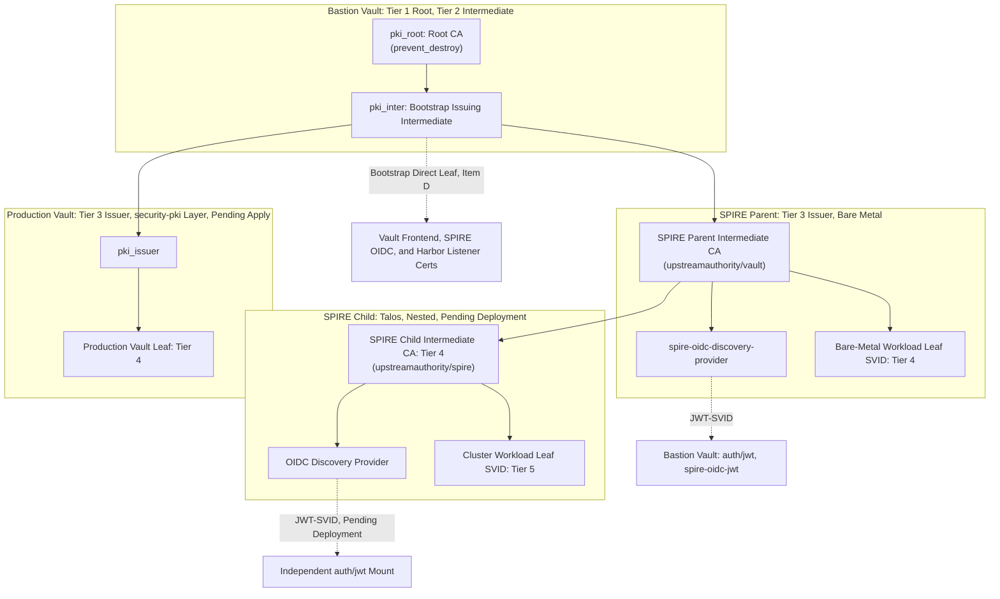

# SPIRE and Vault Workload Identity Federation

This specification states the coordination contract between the SPIRE trust domain rooted at `platform-spire-parent-frontend` and the Bastion Vault instance managed by `foundation-vault-bastion`. Section 1 through Section 3 state the overall Parent and Child SPIRE topology, the Bastion and Production Vault trust chain, the design rationale behind that architecture, and the tradeoffs accepted in reaching it. Section 4 through Section 9 state the implementation-level contract already realized in Terraform and Ansible. Scope covers the OIDC Discovery Provider deployment, the `vault-spiffe-workload-identity-federation` module, and the `utils_spire_vault_agent` and `utils_spire_workload_entry` Ansible roles consumed by `platform-harbor-origin-frontend`. Service-specific identity and PKI role decisions belong to the consuming layer's own configuration, rather than to the present specification. Architectural rationale for the broader SPIFFE/SPIRE and Vault convergence resides in `planning/architecture_meta-platform.md` Section 9.

## Section 1. Overall Architecture and Trust Chain Topology

### Item A. Zero-Key Distribution Motivation

1. A zero-key trust model authenticates a workload through runtime attestation and issues a short-lived credential, eliminating a static secret that requires pre-generation, distribution, and rotation.
2. The AppRole authentication model requires a static `secret_id` credential that exists throughout the full generation-to-consumption lifecycle.
3. A trusted-orchestrator pattern secures the delivery path for that credential without removing the credential.
4. SPIRE issues a short-lived SPIFFE Verifiable Identity Document (SVID) after runtime attestation, removing the pre-generation and rotation requirement that the AppRole `secret_id` model carries.
5. Vault's native `auth/spiffe` method requires a Vault Enterprise license, and Bastion Vault runs the Community edition through the public `docker.io/hashicorp/vault:2.0` image, an edition lacking that method.
6. SPIRE's own `spire-oidc-discovery-provider` component publishes JWT signing keys as an OIDC discovery and JWKS endpoint, and Vault's existing `auth/jwt` method validates a JWT-SVID against that endpoint.

### Item B. Nested Parent and Child Topology within One Trust Domain

1. SPIRE Server deploys in two tiers under one trust domain, following a Nested topology: SPIRE Parent runs as a bare-metal virtual machine, and SPIRE Child runs on Talos through the `spire-nested` Helm chart.
2. SPIRE Parent serves rootless Podman workloads running directly on bare metal, and SPIRE Child, once deployed, serves workloads running inside the Cilium-fronted Kubernetes cluster.
3. SPIRE Child obtains an Intermediate CA from SPIRE Parent through the `upstreamauthority/spire` plugin, using a SPIRE Agent colocated with SPIRE Child that authenticates against SPIRE Parent through the Workload API.
4. A single SPIRE Server instance accepts exactly one `UpstreamAuthority` configuration, and SPIRE Child MUST NOT configure `UpstreamAuthority "vault"` alongside `UpstreamAuthority "spire"`.
5. Nested topology chains multiple SPIRE Server instances within a single trust domain, distinct from federation, which exchanges trust bundles across separate trust domains.

### Item C. The Four-Tier PKI Hierarchy: Root, Intermediate, Issuer, and Leaf

1. Bastion Vault's `pki_root` mount holds a self-signed Root CA, Tier 1 of the hierarchy, and signs exclusively the `pki_inter` mount.
2. Bastion Vault's `pki_inter` mount holds the Bootstrap Issuing Intermediate CA, Tier 2 of the hierarchy, signed by `pki_root`.
3. A dedicated Issuer CA, Tier 3 of the hierarchy, signed by `pki_inter`, precedes a consumer's own leaf certificates, Tier 4, for every consumer requiring an independent signing authority.
4. Module `vault-pki-setup`, invoked by layer `security-pki`, realizes the Tier 3 role for Production Vault as mount `pki_issuer`, producing the chain `pki_root`, `pki_inter`, `pki_issuer`, and leaf.
5. SPIRE Parent's own Intermediate CA realizes the same Tier 3 role for the SPIFFE workload identity hierarchy, signed directly by `pki_inter` through SPIRE's built-in `upstreamauthority/vault` plugin.
6. Production Vault's `pki_issuer` mount and SPIRE Parent's own Intermediate CA stand as sibling Tier 3 branches under the shared `pki_inter` mount, since Production Vault plays no role in signing SPIRE Parent's Intermediate CA.
7. Resource `pki_root` carries `prevent_destroy = true`, and every downstream Tier 3 and Tier 4 certificate inherits that protection through the shared `pki_inter` dependency.
8. SPIRE Parent's own Intermediate CA additionally signs SPIRE Child's Intermediate CA on the SPIRE branch, and SPIRE Child signs a workload's leaf SVID, extending that branch to five tiers for a Child-attested workload.

### Item D. Bootstrap Leaf Issuance Bypasses the Issuer Tier

1. Layer `security-pki` requires an authenticated connection to Production Vault, and Production Vault becomes reachable only after the Harbor bootstrapper and Cilium complete in the platform deployment order.
2. Layer `security-pki` remains unapplied while Production Vault remains unprovisioned, and the Tier 3 `pki_issuer` mount carries no issued certificate until that layer applies.
3. Every currently applied leaf certificate across the platform bypasses the Tier 3 Issuer and issues directly from Bastion Vault's Tier 2 `pki_inter` mount, matching the bootstrap exception that `pki_inter`'s own mount description declares.
4. Resource `vault_pki_secret_backend_cert.listener` in layer `platform-vault-frontend` issues Production Vault's own bootstrap HTTPS listener certificate directly from `pki_inter`.
5. Resource `vault_pki_secret_backend_cert.oidc_discovery` in layer `platform-spire-parent-frontend` issues the OIDC Discovery Provider's listener certificate directly from `pki_inter`.
6. Resource `vault_pki_secret_backend_cert.listener` in layer `platform-harbor-origin-frontend` issues Harbor's bootstrap HTTPS listener certificate directly from `pki_inter`.
7. Module `vault-spiffe-workload-identity-federation`, invoked by layer `platform-harbor-origin-frontend` for the SPIFFE-authenticated workload certificate, receives argument `pki_mount_path` set to `pki_inter` rather than to `pki_issuer`.
8. Each bypass in Item D.4 through Item D.7 is expected to migrate argument `pki_mount_path` from `pki_inter` to `pki_issuer` once layer `security-pki` applies, since the Tier 3 Issuer becomes the standard target for a leaf certificate at that point.

### Item E. Per-Issuer JWT Federation Boundary

1. The `upstreamauthority/vault` plugin does not support the `PublishJWTKey` RPC, a limitation that would normally block global JWT-SVID interoperability across a Nested topology.
2. Global JWT interoperability is not required across the Nested SPIRE topology, since JWT-SVID authentication follows a one-issuer-one-mount convention already established for `gitlab-saas-jwt`.
3. SPIRE Parent's workload authentication mounts on the `auth/jwt` backend fronted by SPIRE Parent's own `spire-oidc-discovery-provider` instance.
4. SPIRE Child's workload authentication, once deployed, mounts on an independent `auth/jwt` backend fronted by SPIRE Child's own OIDC Discovery Provider instance, requiring no JWT key relay from SPIRE Parent.
5. X.509-SVID authentication follows the PKI certificate chain established in Item C and carries no dependency on the `PublishJWTKey` RPC.

### Item F. Trust Chain Topology Diagram

## Section 2. Design Rationale

### Item A. Bastion `pki_inter` Precedes Production Vault in Sequencing

1. SPIFFE/SPIRE deployment is prioritized ahead of the Production Vault provisioning chain.
2. Signing SPIRE Parent's Intermediate CA against Production Vault would require Production Vault's own PKI to already be available, and Production Vault's availability depends on the Harbor bootstrapper and Cilium completing first in the platform deployment order.
3. Signing against Bastion Vault's `pki_inter` mount removes that ordering dependency, since Bastion Vault MUST already be available before any Terraform apply operation across the repository.

### Item B. `join_token` Node Attestor Selection

1. The bare-metal environment provides no cloud instance identity document and no established TPM provisioning process, excluding the `aws_iid`, `gcp_iit`, and `tpm_devid` node attestor plugins.
2. Host count remains small and fixed rather than dynamically scaled, and `join_token` node attestation carries the lowest operational cost at that scale.
3. `spire-server token generate` produces a single-use token consumed once during initial attestation, and a SPIRE Agent completes subsequent identity renewal using the credential obtained from that attestation, without reusing the original token.

### Item C. AppRole for the `upstreamauthority/vault` Bootstrap Exception

1. SPIRE Server holds no SVID during a first Intermediate CA signing request, excluding SVID-based authentication for that request.
2. The `upstreamauthority/vault` plugin supports AppRole, Token, and TLS client certificate authentication for that bootstrap request.
3. TLS client certificate authentication is excluded, since issuance of that certificate would itself require prior authentication against `pki_inter`, the mount SPIRE seeks to reach through the bootstrap request under evaluation.
4. Token authentication carries a coarser permission scope than AppRole.
5. AppRole authentication is selected, reusing the existing `security-vault-approle` layer and AppRole module without introducing a new credential type.

### Item D. `docker` Workload Attestor and Rootless Podman Alignment

1. The `docker` WorkloadAttestor plugin natively supports rootless Podman, detecting a workload's cgroup path and selecting the corresponding per-UID Podman socket automatically upon matching a `/user-<uid>.slice/` pattern.
2. Both `meta-platform` and `on-premise-agent` already run workloads under rootless Podman, and the `docker` WorkloadAttestor plugin requires no change to that execution model.
3. SPIRE Child, once deployed on Talos, uses the Helm chart's default `k8s_psat` node attestor and `k8s` workload attestor, an attestor pairing independent of SPIRE Parent's `docker` attestor selection.

## Section 3. Accepted Tradeoffs

### Item A. Automated Token Generation Removes a Manual Approval Boundary

1. Role `utils_spire_agent` generates and consumes a `join_token` within a single automation run, removing the manual approval boundary that would otherwise separate identity generation from identity consumption.
2. Accepting that removal trades a smaller manual-approval control for a lower operational cost, given a small and Terraform-version-controlled consumer host list.

### Item B. Token Regeneration Invalidates Existing Workload Entries

1. The `join_token` node attestor produces no node selector, and the resulting Agent SPIFFE ID embeds the token value directly as `spiffe://<trust_domain>/spire/agent/join_token/<token>`.
2. Since no node-alias mechanism exists without a node selector, a workload registration entry's `parentID` argument references that token-embedded Agent ID directly.
3. Regenerating a `join_token` produces a new Agent identity, and every workload entry registered under the previous Agent ID becomes invalid, requiring individual re-registration rather than a single token refresh.

### Item C. The Bootstrap AppRole Remains a Permanent Static Trust Root

1. SPIFFE/SPIRE removes the static-credential requirement for a workload capable of runtime attestation.
2. The `upstreamauthority/vault` plugin's own bootstrap authentication in Section 2 Item C falls outside that capability, since SPIRE Server cannot attest itself before holding a CA.
3. The bootstrap AppRole is accepted as a permanent, deliberately retained trust root rather than an incomplete migration item.
4. Risk reduction for that path proceeds through narrowing the AppRole's permission scope and shortening the AppRole's credential lifetime, rather than through replacing AppRole with SPIFFE authentication.

### Item D. Single Bastion Root Creates a Shared Failure Domain

1. A full rebuild of Bastion Vault that discards Raft storage forces re-signing of SPIRE's Intermediate CA, since the shared `pki_root` trust anchor would no longer exist.
2. That failure mode already exists in the pre-SPIRE PKI design, affecting Production Vault's own intermediate certificate under the same condition.
3. SPIRE's adoption of `pki_inter` introduces no new instance of that risk.

## Section 4. Trust Chain Establishment at the Bastion Vault Boundary

### Item A. OIDC Discovery Provider Release Artifact

1. The SPIRE distribution publishes the OIDC Discovery Provider binary in a release archive named `spire-extras`, separate from the primary `spire-<version>` archive containing `spire-server` and `spire-agent`.
2. The `base_baremetal_spire` role MUST download and checksum-verify both archives as independent steps, since neither archive supersedes or contains the other.

### Item B. OIDC Discovery Provider Listener Binding

1. The OIDC Discovery Provider listener domain MUST equal `spire_parent_node_ip`.
2. DNS resolution for the SPIRE trust domain is unavailable during the bootstrapping stage, and a Vault discovery request sends `spire_parent_node_ip` in the HTTP Host header.
3. A listener domain value other than `spire_parent_node_ip` causes the listener's virtual-host check to reject an incoming Vault discovery request with an HTTP 400 response.

### Item C. Bastion Vault JWT Auth Backend Provisioning

1. Resource `vault_jwt_auth_backend.spire_oidc` declares `oidc_discovery_url` as `https://<spire_parent_node_ip>:<spire_oidc_port>`.
2. Vault validates `oidc_discovery_url` through an active HTTP fetch at resource creation.
3. Resource `vault_jwt_auth_backend.spire_oidc` references no attribute of module `platform_spire_parent`, and the Terraform graph infers no implicit dependency ordering from an attribute reference alone.
4. An explicit `depends_on = [module.platform_spire_parent]` argument enforces execution after module `platform_spire_parent` completion, since the discovery fetch in Item C.2 requires an already-running OIDC Discovery Provider listener.
5. Argument `oidc_discovery_ca_pem` requires exactly one PEM string, since the underlying provider schema declares a scalar `string` type rather than a list type.

### Item D. Vault ACL Scope for the JWT Mount

1. Local `jwt_auth_backend_policy` generates an identical five-grant ACL template for every entry in local `jwt_auth_backends`, since `gitlab-saas-jwt` and `spire-oidc-jwt` require the same backend management, mount configuration, mount tuning, OIDC configuration, and role provisioning capabilities.
2. The generated backend management grant scopes `sudo` and lifecycle capabilities to the exact path `sys/auth/spire-oidc-jwt`, excluding any mount whose path merely shares the `spire-oidc-jwt` prefix.
3. The generated mount configuration grant scopes read, create, and update capabilities to the trailing-glob path `sys/mounts/auth/spire-oidc-jwt*`, covering configuration operations nested under the mount path.
4. The generated mount tuning grant scopes create, read, and update capabilities to the exact path `sys/auth/spire-oidc-jwt/tune`, since Vault separates auth-method tuning under `sys/auth/` from the mount configuration paths under `sys/mounts/`.

### Item E. Bastion Vault `terraform-admin` Policy Grant Reference

1. Grant `[1]` authorizes read, create, update, and soft-delete capabilities for secret payloads under `secret/data/meta-platform/*`.
2. Grant `[2]` authorizes read, list, and delete capabilities for secret metadata under `secret/metadata/meta-platform/*`, required during plan execution and resource destruction.
3. Grant `[3]` authorizes update capabilities on secret version deletion endpoints under `secret/delete/meta-platform/*`.
4. Grant `[4]` authorizes update capabilities on permanent secret destruction endpoints under `secret/destroy/meta-platform/*`.
5. Grant `[4a]` authorizes the Vault CLI's KV v1 and v2 mount-type detection request under `sys/internal/ui/mounts/secret/*`, issued before every KV read or write against the `secret/` mount.
6. Grant `[4b]` authorizes read, create, update, and soft-delete capabilities for bootstrap credential payloads under `secret/data/meta-platform-credentials/*`.
7. Grant `[4c]` authorizes read, list, and delete capabilities for bootstrap credential metadata under `secret/metadata/meta-platform-credentials/*`.
8. Grant `[4d]` authorizes update capabilities on bootstrap credential version deletion endpoints under `secret/delete/meta-platform-credentials/*`.
9. Grant `[4e]` authorizes update capabilities on permanent bootstrap credential destruction endpoints under `secret/destroy/meta-platform-credentials/*`.
10. Grant `[5]` authorizes leaf certificate issuance under `${bastion_pki_inter_mount_path}/issue/*`, against the bootstrap issuing intermediate authority prior to Production Vault availability.
11. Grant `[6]` authorizes read access to intermediate PKI mount configurations under `sys/mounts/${bastion_pki_inter_mount_path}`, required for provider state refresh.
12. Grant `[7]` authorizes intermediate certificate signing requests under `${bastion_pki_inter_mount_path}/root/sign-intermediate`, submitted to the bootstrap issuing intermediate.
13. Grant `[8]` authorizes read-only access to `sys/auth`, required for auth backend path resolution.
14. The generated JWT auth backend grants stated in Item D repeat once for every entry in local `jwt_auth_backends`.
15. Grant `[9]` authorizes ACL policy CRUD operations under `sys/policies/acl/jwt-policy-*`, scoped to the `jwt-policy-*` naming convention.

## Section 5. Per-Consumer Role Provisioning

### Item A. Module Contract for `vault-spiffe-workload-identity-federation`

1. Variable `spiffe_id` binds to argument `bound_subject` on resource `vault_jwt_auth_backend_role.this`, constraining JWT-SVID authentication to a single exact SPIFFE ID.
2. Argument `bound_audiences` is a required argument for `role_type = "jwt"` and defaults to `["vault"]`, matching the `jwt_audience` value that `spiffe-helper` requests from the SPIRE Workload API.
3. Argument `user_claim = "sub"` directs Vault to read the authenticating identity from the JWT-SVID subject claim, the field carrying the SPIFFE ID string.

### Item B. Policy Naming Constraint

1. Resource `vault_policy.this` MUST generate a policy name matching the `jwt-policy-*` prefix, since `terraform-admin-policy` restricts `sys/policies/acl/*` management to that glob for JWT-backed policies.
2. A policy name outside the `jwt-policy-*` glob causes Vault to reject the policy write with an HTTP 403 response under the calling module's own AppRole credentials.

## Section 6. Workload Attestation and Containerization Constraint

### Item A. `docker` Workload Attestor Scope

1. The `docker` WorkloadAttestor plugin attests exclusively processes running inside a Docker or Podman container, confirmed through a failed `spire-agent api fetch jwt` invocation against a bare host process.
2. A workload requiring JWT-SVID issuance MUST run inside a container carrying a label matching the selector registered for the workload's own SPIRE entry.

### Item B. `spiffe-helper` Containerization at Packer Build Time

1. Role `base_docker_spiffe_helper` builds a container image for `spiffe-helper` at Packer build time, appended to the `base-docker-harbor` build immediately after role `base_docker`.
2. The container image builds from an empty `scratch` base layer, since the `spiffe-helper` binary links statically without a libc runtime dependency.
3. A running `spiffe-helper` container carries label `spiffe-workload` set to `spire_cluster_name`, matching the selector value registered by role `utils_spire_workload_entry`.

## Section 7. Vault Agent Certificate Deployment

### Item A. JWT Auto-Auth Method

1. Vault Agent's `auto_auth` stanza uses method `jwt`, reading the JWT-SVID file that `spiffe-helper` writes to `utils_spire_vault_agent_jwt_dir`.
2. Argument `remove_jwt_after_reading` is set to `false`, departing from the HashiCorp default of `true`, since `spiffe-helper` rewrites the JWT-SVID file on a fixed rotation schedule rather than on a per-read basis.

### Item B. Listener Certificate Authority Separation

1. The certificate template deployed to `utils_spire_vault_agent_cert_files` appends the intermediate CA decoded from `vault_intermediate_ca_b64`.
2. Vault Agent's own HTTPS listener certificate MUST source a trusted CA from `utils_spire_vault_agent_vault_listener_ca_cert_b64`, a variable distinct from `vault_intermediate_ca_b64`.
3. The issuing CA record for the `pki_int` chain remains self-signed pending a rotation fix, and reusing the `pki_int` issuing CA record as the listener CA would couple an unrelated rotation state to Vault Agent's own connectivity.

### Item C. Script-Based Certificate Deployment

1. Template `vault-agent.hcl.j2` renders a single executable shell script for certificate deployment, invoked through the `command` argument on the `template` stanza.
2. A single-script design eliminates a JSON-parsing dependency.
3. A single-script design eliminates a certificate-and-key mismatch that a template-per-file design would risk under partial write failure.

## Section 8. Workload Entry Registration

### Item A. Agent Parent ID Resolution

1. Role `utils_spire_workload_entry` reads `join_token` from Bastion Vault as the lookup key for `inventory_hostname`'s Agent SPIFFE ID.
2. A persisted Vault record allows a subsequent playbook run to resolve the same parent ID, since Ansible facts from the initial node attestation do not survive across separate playbook invocations.

### Item B. Idempotent Entry Creation

1. Task `spire-server entry show` MUST precede task `spire-server entry create` within Block B.
2. Task `spire-server entry create` executes only when the preceding `entry show` query returns zero existing entries for the target SPIFFE ID.

## Section 9. Harbor Origin Consumption Ordering

### Item A. Role Sequencing in `platform_harbor_origin`

1. Role 83 (`utils_spire_agent`) and Role 84 (`utils_spire_workload_entry`) execute before Role 82 (`utils_spire_vault_agent`), since certificate issuance in Role 82 depends on an SPIFFE ID already registered as a SPIRE workload entry.
2. Role 82 executes only when `harbor_origin_stage == "registered"`, `spire_oidc_auth_path` is defined, and `spire_workload_vault_role_name` is defined, gating SPIFFE-based certificate issuance behind a Stage 2 Cilium VIP prerequisite that Harbor Origin's staged rollout defines.
