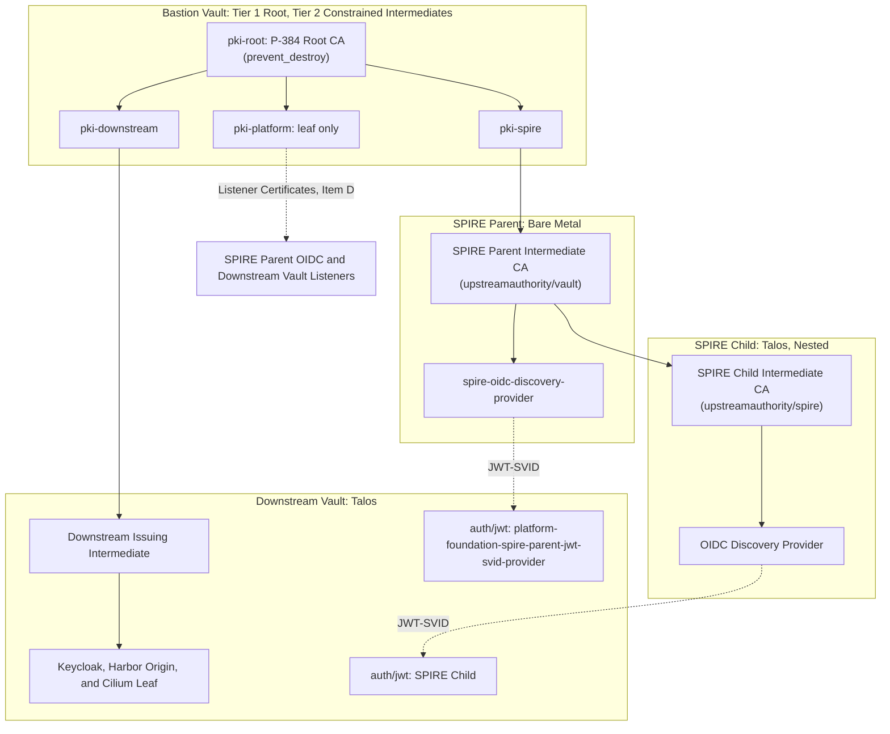

# SPIRE and Vault Workload Identity Federation

This specification states the coordination contract between the SPIRE trust domain rooted at `platform-spire-parent` and the Bastion Vault instance managed by `foundation-vault-bastion`. Section 1 through Section 3 state the overall Parent and Child SPIRE topology, the Bastion and Downstream Vault trust chain, the design rationale behind that architecture, and the tradeoffs accepted in reaching that architecture. Section 4 through Section 10 state the implementation-level contract already realized in Terraform and Ansible. Scope covers the OIDC Discovery Provider deployment, the `vault-spiffe-workload-identity-federation` module, and the `utils_vault_agent` and `utils_spire_workload_entry` Ansible roles consumed by `platform-harbor-origin-frontend`. Service-specific identity and PKI role decisions belong to the consuming layer's own configuration, rather than to the present specification. Architectural rationale for the broader SPIFFE/SPIRE and Vault convergence resides in `planning/architecture_platform-foundation.md` Section 9.

## Section 1. Overall Architecture and Trust Chain Topology

### Item A. Zero-Key Distribution Motivation

1. A zero-key trust model authenticates a workload through runtime attestation and issues a short-lived credential, eliminating a static secret that requires pre-generation, distribution, and rotation.
2. The AppRole authentication model requires a static `secret_id` credential that exists throughout the full generation-to-consumption lifecycle.
3. A trusted-orchestrator pattern secures the delivery path for that credential without removing the credential.
4. SPIRE issues a short-lived SPIFFE Verifiable Identity Document (SVID) after runtime attestation, removing the pre-generation and rotation requirement that the AppRole `secret_id` model carries.
5. Vault's native `auth/spiffe` method requires a Vault Enterprise license, and Bastion Vault runs the Community edition through the public `docker.io/hashicorp/vault:2.0` image, an edition lacking that method.
6. SPIRE's own `spire-oidc-discovery-provider` component publishes JWT signing keys as an OIDC discovery and JWKS endpoint, and Vault's existing `auth/jwt` method validates a JWT-SVID against that endpoint.

### Item B. Nested Parent and Child Topology within One Trust Domain

1. SPIRE Server deploys in two tiers under one trust domain, following a Nested topology: SPIRE Parent runs as a bare-metal virtual machine, and SPIRE Child runs on Talos through the `spire-nested` Helm chart.
2. SPIRE Parent serves the operator workstation, whose identities reach the Downstream Vault. SPIRE Child serves every downstream workload, which comprises the pods of the Cilium-fronted Kubernetes cluster and the rootless Podman workloads of the Keycloak and Harbor Origin virtual machines. The operator identities stay on SPIRE Parent, since the Downstream Vault precedes SPIRE Child.
3. SPIRE Child obtains an Intermediate CA from SPIRE Parent through the `upstreamauthority/spire` plugin, using a SPIRE Agent colocated with SPIRE Child that authenticates against SPIRE Parent through the Workload API.
4. A single SPIRE Server instance accepts exactly one `UpstreamAuthority` configuration, and SPIRE Child MUST NOT configure `UpstreamAuthority "vault"` alongside `UpstreamAuthority "spire"`.
5. Nested topology chains multiple SPIRE Server instances within a single trust domain, distinct from federation, which exchanges trust bundles across separate trust domains.

### Item C. The Constrained PKI Hierarchy: Root, Constrained Intermediate, Issuer, and Leaf

1. Bastion Vault's `pki-root` mount holds a self-signed P-384 Root CA, Tier 1 of the hierarchy, which expires before 2036.
2. `pki-root` signs three constrained P-256 intermediates for the tenant `platform-foundation`, Tier 2 of the hierarchy. RFC 5280 Name Constraints in each certificate bind every subordinate certificate, whatever a caller of `root/sign-intermediate` passes.
3. `pki-spire` permits the SPIRE trust domains of `registry/platform/trust` alone and signs the Intermediate CA of SPIRE Parent through the `upstreamauthority/vault` plugin.
4. `pki-downstream` permits the platform domain, the Hubble names, and the platform network, excludes the Bastion publish network and every SPIFFE URI under the platform domain, and signs the Issuing Intermediate of Downstream Vault.
5. `pki-platform` carries a zero path length, issues leaf certificates alone, and permits the platform domain, `cluster.local`, and the platform network. The listeners of SPIRE Parent OIDC and Downstream Vault take their certificates from `pki-platform`.
6. Module `vault-pki-setup`, invoked by layer `security-vault-downstream-pki`, realizes the Tier 3 role for Downstream Vault. Downstream Vault generates the P-256 CSR and keeps the private key, `pki-downstream` signs the CSR through `root/sign-intermediate`, and the signed certificate returns to Downstream Vault. The signing request carries a DNS name inside the permitted subtree, since a signer with permitted DNS constraints rejects a CA certificate without one.
7. SPIRE Parent's own Intermediate CA additionally signs SPIRE Child's Intermediate CA on the SPIRE branch, and SPIRE Child signs a workload's leaf SVID.
8. Resource `pki_root` carries `prevent_destroy = true` in `parent-group-governance`.

### Item D. Listener Certificates Outside the Terraform State

1. The listener certificates of SPIRE Parent OIDC and Downstream Vault issue from `pki-platform`. The arrangement is permanent since these listeners precede the Downstream Issuing Intermediate.
2. Layer `platform-spire-parent` creates the PKI role `<cluster_name>` on `pki-platform`. The role `platform_spire_parent` issues the OIDC listener certificate from the operator workstation with the tenant token and writes the certificate and the key to the VM, hence neither enters a Terraform state.
3. The play keeps a held certificate which chains to the current `pki-platform` and stays valid beyond 30 days, and issues a new certificate otherwise.
4. Layer `platform-vault-downstream-frontend` creates the Kubernetes auth mount and the PKI role of cert-manager on `pki-platform` in the owned scope of the tenant. cert-manager signs the Downstream Vault listener through the assignable policy `pki-platform-issuer-platform-foundation`.
5. Keycloak, Harbor Origin, and Cilium start after Downstream Vault and take their listener certificates from the Downstream Issuing Intermediate. The layer `security-vault-downstream-pki` declares the PKI role of each service.

### Item E. Per-Issuer JWT Federation Boundary

1. The `upstreamauthority/vault` plugin does not support the `PublishJWTKey` RPC, a limitation that would normally block global JWT-SVID interoperability across a Nested topology.
2. Global JWT interoperability is not required across the Nested SPIRE topology since JWT-SVID authentication follows a one-issuer-one-mount convention already established for `gitlab-saas-ci-job-jwt-provider`.
3. The Bastion Vault does not mount any SPIRE JWT backend. The layers which change the Bastion Vault run through the platform-foundation Vault Proxy of `parent-group-governance`.
4. SPIRE Parent's workload authentication mounts on the `auth/jwt` backend `platform-foundation-spire-parent-jwt-svid-provider` of the Downstream Vault, fronted by SPIRE Parent's own `spire-oidc-discovery-provider` instance. Layer `security-vault-downstream-tenants` binds the role of every operator to the exact SPIFFE ID of that operator.
5. SPIRE Child's workload authentication mounts on an independent `auth/jwt` backend of the Downstream Vault, fronted by SPIRE Child's own OIDC Discovery Provider instance. Layer `provision-spire-child` creates the backend and the roles of the Child tenants after the chart runs, and each role carries the tenant policy which `security-vault-downstream-tenants` declares.
6. X.509-SVID authentication follows the PKI certificate chain established in Item C and carries no dependency on the `PublishJWTKey` RPC.
7. A component operator does not write any policy on the Downstream Vault. The operator policy restricts `token_policies` on the owned auth mounts of the component through `allowed_parameters` to the workload policies which `security-vault-downstream-tenants` declares, following the tenant ACL of the Bastion Vault.

### Item F. Trust Chain Topology Diagram

```mermaid
flowchart TD
    subgraph BASTION ["Bastion Vault: Tier 1 Root, Tier 2 Constrained Intermediates"]
        ROOT["pki-root: P-384 Root CA\n(prevent_destroy)"]
        SPIRE_INTER["pki-spire"]
        DOWN_INTER["pki-downstream"]
        PLATFORM_INTER["pki-platform: leaf only"]
    end

    subgraph PARENT ["SPIRE Parent: Bare Metal"]
        PARENT_CA["SPIRE Parent Intermediate CA\n(upstreamauthority/vault)"]
        PARENT_OIDC["spire-oidc-discovery-provider"]
    end

    subgraph CHILD ["SPIRE Child: Talos, Nested"]
        CHILD_CA["SPIRE Child Intermediate CA\n(upstreamauthority/spire)"]
        CHILD_OIDC["OIDC Discovery Provider"]
    end

    subgraph PRODVAULT ["Downstream Vault: Talos"]
        PROD_ISSUER["Downstream Issuing Intermediate"]
        PROD_LEAF["Keycloak, Harbor Origin, and Cilium Leaf"]
        PARENT_JWT["auth/jwt: platform-foundation-spire-parent-jwt-svid-provider"]
        CHILD_JWT["auth/jwt: SPIRE Child"]
    end

    ROOT --> SPIRE_INTER
    ROOT --> DOWN_INTER
    ROOT --> PLATFORM_INTER
    SPIRE_INTER --> PARENT_CA
    DOWN_INTER --> PROD_ISSUER
    PROD_ISSUER --> PROD_LEAF
    PARENT_CA --> CHILD_CA
    PARENT_CA --> PARENT_OIDC
    CHILD_CA --> CHILD_OIDC
    PLATFORM_INTER -.->|Listener Certificates, Item D| LISTENERS["SPIRE Parent OIDC and Downstream Vault Listeners"]
    PARENT_OIDC -.->|JWT-SVID| PARENT_JWT
    CHILD_OIDC -.->|JWT-SVID| CHILD_JWT
```

## Section 2. Design Rationale

### Item A. Bastion `pki-spire` Precedes Downstream Vault in Sequencing

1. SPIFFE/SPIRE deployment is prioritized ahead of the Downstream Vault provisioning chain.
2. Signing SPIRE Parent's Intermediate CA against Downstream Vault would require Downstream Vault's own PKI to already be available, while the Downstream Vault trusts the JWT-SVIDs of SPIRE Parent.
3. Signing against Bastion Vault's `pki-spire` mount removes that ordering dependency since Bastion Vault MUST already be available before any Terraform apply operation across the repository.

### Item B. `join_token` Node Attestor Selection

1. The bare-metal environment provides no cloud instance identity document and no established TPM provisioning process, excluding the `aws_iid`, `gcp_iit`, and `tpm_devid` node attestor plugins.
2. Host count remains small and fixed rather than dynamically scaled, and `join_token` node attestation carries the lowest operational cost at that scale.
3. `spire-server token generate` produces a single-use token consumed once during initial attestation, and a SPIRE Agent completes subsequent identity renewal using the credential obtained from that attestation, without reusing the original token.

### Item C. AppRole for the `upstreamauthority/vault` Bootstrap Exception

1. SPIRE Server holds no SVID during a first Intermediate CA signing request, excluding SVID-based authentication for that request.
2. The `upstreamauthority/vault` plugin supports AppRole, Token, and TLS client certificate authentication for that bootstrap request.
3. TLS client certificate authentication is excluded since issuance of that certificate would itself require prior authentication against the Bastion Vault, which the bootstrap request under evaluation seeks to reach.
4. Token authentication carries a coarser permission scope than AppRole.
5. AppRole authentication is selected. Layer `platform-spire-parent` creates the AppRole `<cluster_name>-upstream-authority` with the policy `pki-spire-signer-platform-foundation`, which `parent-group-governance` declares. The role `platform_spire_parent` issues the secret ID with the tenant token and writes the secret ID to a root-only `EnvironmentFile` of the SPIRE Server unit as `VAULT_APPROLE_SECRET_ID`, hence the secret ID never enters a Terraform state.

### Item D. `docker` Workload Attestor and Rootless Podman Alignment

1. The `docker` WorkloadAttestor plugin natively supports rootless Podman, detecting a workload's cgroup path and selecting the corresponding per-UID Podman socket automatically upon matching a `/user-<uid>.slice/` pattern.
2. Both `platform-foundation` and `on-premise-agent` already run workloads under rootless Podman, and the `docker` WorkloadAttestor plugin requires no change to that execution model.
3. SPIRE Child, once deployed on Talos, uses the Helm chart's default `k8s_psat` node attestor and `k8s` workload attestor, an attestor pairing independent of SPIRE Parent's `docker` attestor selection.

## Section 3. Accepted Tradeoffs

### Item A. Automated Token Generation Removes a Manual Approval Boundary

1. Role `utils_spire_agent` generates and consumes a `join_token` within a single automation run, removing the manual approval boundary that would otherwise separate identity generation from identity consumption.
2. Accepting that removal trades a smaller manual-approval control for a lower operational cost, given a small and Terraform-version-controlled consumer host list.

### Item B. Token Regeneration Invalidates Existing Workload Entries

1. The `join_token` node attestor produces no node selector, and the resulting Agent SPIFFE ID embeds the token value directly as `spiffe://<trust_domain>/spire/agent/join_token/<token>`.
2. Since no node-alias mechanism exists without a node selector, a workload registration entry's `parentID` argument references that token-embedded Agent ID directly.
3. Regenerating a `join_token` produces a new Agent identity, and every workload entry registered under the previous Agent ID becomes invalid, requiring individual re-registration rather than a single token refresh.

### Item C. The Bootstrap AppRole Remains a Permanent Static Trust Root

1. SPIFFE/SPIRE removes the static-credential requirement for a workload capable of runtime attestation.
2. The `upstreamauthority/vault` plugin's own bootstrap authentication in Section 2 Item C falls outside that capability since SPIRE Server cannot attest itself before holding a CA.
3. The bootstrap AppRole is accepted as a permanent, deliberately retained trust root rather than an incomplete migration item.
4. Risk reduction for that path proceeds through narrowing the AppRole's permission scope and shortening the AppRole's credential lifetime, rather than through replacing AppRole with SPIFFE authentication.

### Item D. Single Bastion Root Creates a Shared Failure Domain

1. A full rebuild of Bastion Vault that discards Raft storage forces re-signing of SPIRE's Intermediate CA since the shared `pki-root` trust anchor would no longer exist.
2. That failure mode already exists in the pre-SPIRE PKI design, affecting Downstream Vault's own intermediate certificate under the same condition.
3. SPIRE's adoption of `pki-spire` introduces no new instance of that risk.

## Section 4. Trust Chain Establishment at the Bastion Vault Boundary

### Item A. OIDC Discovery Provider Release Artifact

1. The SPIRE distribution publishes the OIDC Discovery Provider binary in a release archive named `spire-extras`, separate from the primary `spire-<version>` archive containing `spire-server` and `spire-agent`.
2. The `base_baremetal_spire` role MUST download and checksum-verify both archives as independent steps since neither archive supersedes or contains the other.

### Item B. OIDC Discovery Provider Listener Binding

1. The OIDC Discovery Provider listener domain MUST equal `spire_parent_node_ip`.
2. DNS resolution for the SPIRE trust domain is unavailable during the bootstrapping stage, and a Vault discovery request sends `spire_parent_node_ip` in the HTTP Host header.
3. A listener domain value other than `spire_parent_node_ip` causes the listener's virtual-host check to reject an incoming Vault discovery request with an HTTP 400 response.

### Item C. Downstream Vault JWT Auth Backend Provisioning

1. Resource `vault_jwt_auth_backend.spire_parent` of layer `security-vault-downstream-tenants` declares `oidc_discovery_url` as `https://<spire_parent_node_ip>:<spire_oidc_port>`.
2. Vault validates `oidc_discovery_url` through an active HTTP fetch at resource creation, hence the layer runs after `platform-spire-parent`.
3. Argument `oidc_discovery_ca_pem` takes the field `discovery_ca_pem` of the output `spire_oidc` of `platform-spire-parent`, the Bastion root followed by the `pki-platform` certificate, as one PEM string.

### Item D. Tenant ACL Scope

1. Bastion Vault grants tenant `platform-foundation` one ACL policy, `platform-foundation-terraform-operator`, which layer `foundation-vault-bastion` of `parent-group-governance` declares. The rules fall into the categories KV, auth mount, auth role, PKI, and cross-tenant grants.
2. The KV category scopes secret data, metadata, delete, and destroy paths to the `platform-foundation` namespace of the `secret` mount.
3. The auth mount category scopes mount management to `sys/auth/platform-foundation-*`, `sys/mounts/auth/platform-foundation-*`, and `auth/platform-foundation-*`.
4. The auth role category scopes AppRole and GitLab JWT role management to the `platform-foundation-` prefix.
5. Every auth rule carries `allowed_parameters`, which limits `token_policies` and `policies` to the exact assignable policies of its scope, published in the field `assignable_policies` of `registry/platform-foundation/bastion`.
6. The PKI category grants read on the `pki-platform` mount, role management under `roles/platform-foundation-*`, and issuance under `issue/platform-foundation-*`.
7. The tenant does not write any policy, since Vault OSS bounds neither the content of a policy nor the policies of an auth role.

### Item E. Cross-Tenant Grants

1. The tenant policy does not grant `secret/data/parent-group-governance/terraform/state-backend` or `secret/data/parent-group-governance/github/publication`, which the governance Vault Proxy reads alone.
2. The tenant policy grants create and update on `pki-downstream/root/sign-intermediate`, which layer `security-vault-downstream-pki` uses through the platform-foundation Vault Proxy.
3. The SPIRE upstream authority AppRole holds the policy `pki-spire-signer-platform-foundation`, which grants create and update on `pki-spire/root/sign-intermediate` only.
4. The layers `platform-spire-parent`, `provision-spire-parent`, `platform-vault-downstream-frontend`, `provision-vault-downstream-frontend`, `security-vault-downstream-tenants`, and `security-vault-downstream-pki` run through the platform-foundation Vault Proxy. The Proxy logs in with the client certificate of the identity, and the Ansible plays of these layers present the same certificate.
5. The cert role of the identity binds its token to `127.0.0.1/32`. The SPIRE upstream authority AppRole binds its secret ID and its token to the addresses of the SPIRE Parent nodes on `vault-bastion-publish`.
6. The registry of `parent-group-governance` records each cross-tenant grant together with its reason.

## Section 5. Per-Consumer Role Provisioning

### Item A. Module Contract for `vault-spiffe-workload-identity-federation`

1. Variable `spiffe_id` binds to argument `bound_subject` on resource `vault_jwt_auth_backend_role.this`, constraining JWT-SVID authentication to a single exact SPIFFE ID.
2. Argument `bound_audiences` is a required argument for `role_type = "jwt"` and defaults to `["vault"]`, matching the `jwt_audience` value that `spiffe-helper` requests from the SPIRE Workload API.
3. Argument `user_claim = "sub"` directs Vault to read the authenticating identity from the JWT-SVID subject claim, the field carrying the SPIFFE ID string.

### Item B. Policy Naming

1. The module writes no policy. Variable `token_policies` names the existing policies, and the role carries them besides `default`.
2. The policy of a workload carries the identity string of the workload, and the broker rejects a requested policy name without the `platform-foundation-` prefix.
3. A requested policy declares `assignable_policies`, the policies which the roles written by its holder may carry. The operator of HAProxy assigns the HAProxy workload policy alone, the operator of the Downstream Vault assigns the ClusterIssuer and transit unseal policies alone, and every other operator assigns `default` alone.
4. The former `jwt-policy-` prefix is retired.

## Section 6. Workload Attestation and Containerization Constraint

### Item A. `docker` Workload Attestor Scope

1. The `docker` WorkloadAttestor plugin attests exclusively processes running inside a Docker or Podman container, confirmed through a failed `spire-agent api fetch jwt` invocation against a bare host process.
2. A workload requiring JWT-SVID issuance MUST run inside a container carrying a label matching the selector registered for the workload's own SPIRE entry.

### Item B. `spiffe-helper` Containerization at Packer Build Time

1. Role `base_docker_spiffe_helper` builds a container image for `spiffe-helper` at Packer build time, appended to the `base-docker-harbor` build immediately after role `base_docker`.
2. The container image builds from an empty `scratch` base layer since the `spiffe-helper` binary links statically without a libc runtime dependency.
3. A running `spiffe-helper` container carries label `spiffe-workload` set to `spire_cluster_name`, matching the selector value registered by role `utils_spire_workload_entry`.

## Section 7. Vault Agent Certificate Deployment

### Item A. JWT Auto-Auth Method

1. Vault Agent's `auto_auth` stanza uses method `jwt`, reading the JWT-SVID file that `spiffe-helper` writes to `utils_vault_agent_jwt_dir`.
2. Argument `remove_jwt_after_reading` is set to `false`, departing from the HashiCorp default of `true` since `spiffe-helper` rewrites the JWT-SVID file on a fixed rotation schedule rather than on a per-read basis.

### Item B. Listener Certificate Authority Separation

1. The certificate template deployed to `utils_vault_agent_cert_files` appends the intermediate CA decoded from `vault_intermediate_ca_b64`.
2. Vault Agent's own HTTPS listener certificate MUST source a trusted CA from `utils_vault_agent_vault_listener_ca_cert_b64`, a variable distinct from `vault_intermediate_ca_b64`.
3. The issuing CA record for the `pki-intermediate` chain remains self-signed pending a rotation fix, and reusing the `pki-intermediate` issuing CA record as the listener CA would couple an unrelated rotation state to Vault Agent's own connectivity.

### Item C. Script-Based Certificate Deployment

1. Template `vault-agent.hcl.j2` renders a single executable shell script for certificate deployment, invoked through the `command` argument on the `template` stanza.
2. A single-script design eliminates a JSON-parsing dependency.
3. A single-script design eliminates a certificate-and-key mismatch that a template-per-file design would risk under partial write failure.

## Section 8. Workload Entry Registration

### Item A. Agent Parent ID Resolution

1. Role `utils_spire_workload_entry` reads `join_token` from Bastion Vault as the lookup key for `inventory_hostname`'s Agent SPIFFE ID. The token lives at the join-token leaf below the SPIRE server which issued the token, `<project>/spire/parent/join-token/<cluster>/<host>` or `<project>/spire/child/join-token/<cluster>/<host>`.
2. A persisted Vault record allows a subsequent playbook run to resolve the same parent ID since Ansible facts from the initial node attestation do not survive across separate playbook invocations.

### Item B. Idempotent Entry Creation

1. Task `spire-server entry show` MUST precede task `spire-server entry create` within Block B.
2. Task `spire-server entry create` executes only when the preceding `entry show` query returns zero existing entries for the target SPIFFE ID.

## Section 9. Harbor Origin Consumption Ordering

### Item A. Role Sequencing in `platform_harbor_origin`

1. Role 83 (`utils_spire_agent`) and Role 84 (`utils_spire_workload_entry`) execute before Role 82 (`utils_vault_agent`) since certificate issuance in Role 82 depends on an SPIFFE ID already registered as a SPIRE workload entry.
2. Role 82 executes only when `vault_auth_path` and `vault_agent_auth_role_name` are defined. Both variables come from the tenant login of the Downstream Vault, and the auth path is the mount of SPIRE Child.
3. Role 83 and Role 84 attest the Harbor Origin agent to SPIRE Child. Variable `vault_agent_jwt_audience` carries the audience which the Child mount requires, the cluster name of the Downstream Vault.

## Section 10. Local Terraform Operator Identity

### Item A. Derived Names

1. Layer `provision-spire-parent` derives the operator identity string `<owner>-terraform-operator-<service>-<component>` for each consumer service, and that string names the JWT role and its policy.
2. The SPIFFE ID path of the operator is `/<owner>/terraform-operator/<service>/<component>`.
3. The workload of the consumer uses a role and policy named after its `cluster_name`, and the SPIFFE ID path `/<project_code>/<service>/<component>`.
4. The layer exports the derived role name and wrapper name through output `terraform_operator`, which every layer that reaches the Bastion Vault reads.

### Item B. Host Provisioning and Verification

1. Playbook `playbook_host_terraform_operator.yaml` provisions the SPIRE Agent of the operator host, the service user and JWT-SVID fetch wrapper of each identity, and then verifies each identity.
2. The verification play logs in to Bastion Vault as the operator user without privilege escalation, and asserts that each login grants the policy named after its identity.
3. The operator supplies the sudo password through environment variable `ANSIBLE_BECOME_PASS`, which the playbook and the Terraform action, a child process, both inherit.
4. Role `utils_spire_agent` removes stale agent identity data when the agent fails its health check, and the caller supplies the Bastion Vault CA file through `bastion_vault_ca_cert_path`.

### Item C. Operator Identity for the Downstream Vault

1. The Downstream Vault trusts SPIRE Child only, and the operator identity which reaches the Downstream Vault therefore comes from SPIRE Child.
2. Layer `provision-spire-child` installs a second SPIRE Agent instance, `child`, on the operator host. The instance has its own unit `spire-agent-child`, its own directories, and its own Workload API socket.
3. The same layer registers each operator identity on SPIRE Child and creates the JWT-SVID fetch wrapper `spire-fetch-<identity>-child`. Output `terraform_operator_downstream` exposes the role name, the wrapper name, and the audience, keyed like output `terraform_operator`.
4. The JWT-SVID of that wrapper carries the cluster name of the Downstream Vault as audience, and the operator role on the Child mount of `security-vault-downstream-tenants` binds that audience and the SPIFFE ID glob `spiffe://<trust domain>/<owner>/terraform-operator/*`.
5. The layers which write to the Downstream Vault read the wrapper name from output `terraform_operator_downstream` and log in through the Child mount. The layers which write to the Bastion Vault keep the Parent wrapper.

## Section 11. SPIRE Child as the Server of Downstream Consumers

### Item A. Agent Endpoint

1. Service `spire-internal-server` of the Child chart is a LoadBalancer service. Cilium LB IPAM assigns the VIP at host offset plus two of the Child segment, and L2 announcement makes the VIP reachable from the virtual machines and the operator host.
2. Layer `provision-spire-child` exports the address and port through output `spire_child_agent_endpoint`, and the platform layers of Keycloak and Harbor Origin pass both to role `utils_spire_agent`.
3. The Child server enables the `join_token` node attestor, and the agents of the virtual machines attest with a token which role `utils_spire_agent` generates on the Child server.

### Item B. Registrar Credential

1. Role `utils_spire_server_command` runs `spire-server` commands. For kind `parent`, the role runs the command on the Parent host over SSH. For kind `child`, the role runs the command through `kubectl exec` in the pod of the Child server.
2. Layer `provision-spire-child` creates ServiceAccount `registrar` with a Role limited to `pods get` and `pods/exec get, create` on pod `spire-internal-server-0`, and stores the resulting kubeconfig in the Bastion Vault at the registrar leaf of the Child.
3. The operator policies of `provision-spire-parent` grant read on the registrar leaf, and the roles never hold the admin kubeconfig of the Child cluster.

### Item C. Vault Agent of the Virtual Machines

1. The tenants of Keycloak and Harbor Origin declare issuer `child` in `security-vault-downstream-tenants`, and the Vault Agent logs in through the Child mount.
2. The workload entries of both services register on SPIRE Child through role `utils_spire_workload_entry` with server kind `child`.
